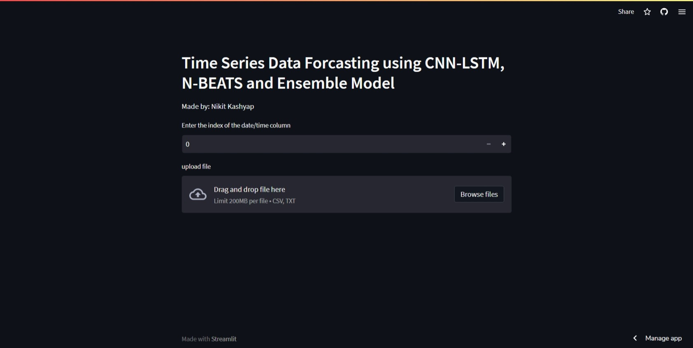

# Time Series Data Forecasting using CNN-LSTM, N-BEATS and Ensemble Model
This Streamlit app allows users to upload their time series data and choose from three models to perform forecasting: CNN-LSTM, N-BEATS, and Ensemble Model.

* [Watch video Demo here 👆](https://www.linkedin.com/posts/activity-7017968597385822208-7cnn?utm_source=share&utm_medium=member_desktop)
* [Streamlit App Link here 👆](https://nikit117-time-series-forcasting-using-streamlit-custom-k8lq0t.streamlit.app/)
## Usage
To use this app, follow the steps below:

1. Run the app on your local machine by executing `streamlit run app.py` in your terminal.
2. Upload your time series data by clicking on the "Upload file" button.
3. Select the index of the date/time column from the dropdown menu.
4. Select the column to be predicted from the dropdown menu.
5. Enter the number of days to be used for prediction.
6. Use the slider to specify the percentage of the dataset to be used for training and testing.
7. Enter the batch size for the models.
8. Use the slider to specify the number of days to be predicted.
9. Select the models to use for forecasting by checking the corresponding checkboxes.
10. Click on the "Run" button to generate the forecasts.
## Code
The app is built with Python and uses the following libraries:

* `os`
* `streamlit`
* `pandas`
* `numpy`
* `matplotlib`
* `tensorflow`

The main function of the app is to allow the user to upload a CSV file, preprocess the data, train and evaluate the models, and generate forecasts.

The app is divided into several sections:

* **Upload file**: This section allows the user to upload a CSV file and select the index of the date/time column.
* **Select column**: This section allows the user to select the column to be predicted.
* **Preprocessing**: This section preprocesses the data by shifting values for each step in the window size and splitting the data into training and testing sets.
* **Model training**: This section trains the models using the training data.
* **Model evaluation**: This section evaluates the models using the testing data.
* **Model selection**: This section allows the user to select the models to use for forecasting.
* **Forecasting**: This section generates forecasts using the selected models.
## References
This app is based on the following resources:
* [N-BEATS: Neural basis expansion analysis for interpretable time series forecasting](https://arxiv.org/abs/1905.10437)
* [Convolutional LSTM Network: A Machine Learning Approach for Precipitation Nowcasting](https://arxiv.org/abs/1506.04214)
* [Ensemble Learning Methods for Time Series Forecasting: A Survey](https://arxiv.org/abs/1910.06371)
## Acknowledgements
This app was made by Nikit Kashyap.
